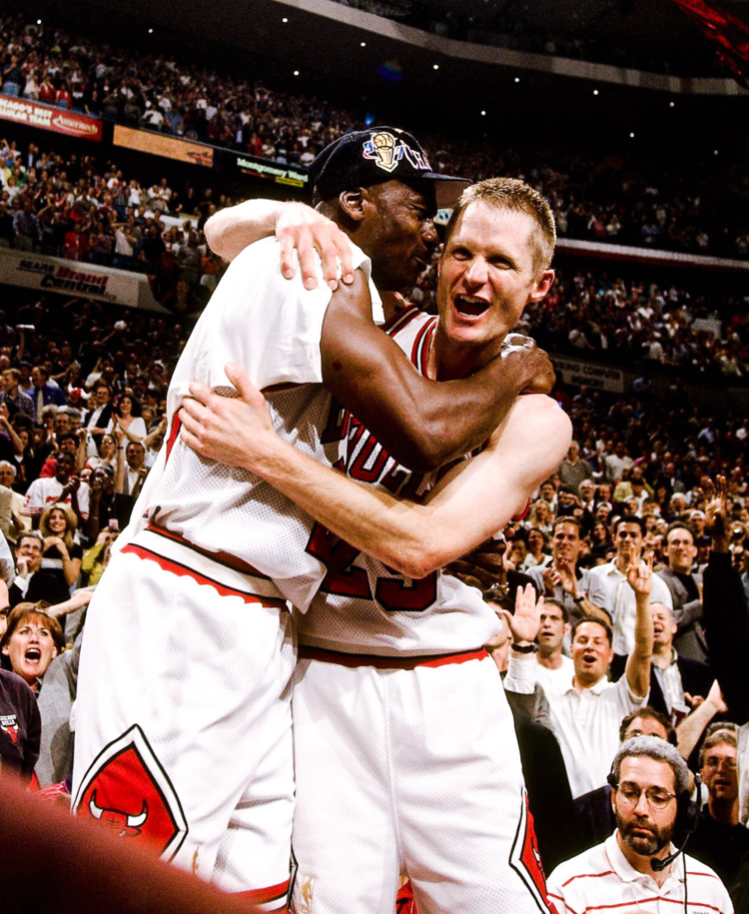

# NBA Clutch Moments with Graph-RAG

This project shows how **Graph-RAG** can retrieve and narrate clutch moments 
from NBA play-by-play data — inspired by *The Last Dance* and the Bulls' golden years.  

By combining a **Graph database** (for structure and facts) with **LLMs** (for narration and context), 
we can surface iconic moments such as Steve Kerr’s game-winning shot in the 1997 NBA Finals.

---

## 🔍 Example Query

**Plain English**
> "Give me the games where, in the last 30 seconds, someone scored and turned it into a victory."

**Generated Cypher**
```cypher
MATCH (e:Event {is_clutch: true, event_type: 1})-[:IN_GAME]->(g:Game)
MATCH (scorer:Player)-[:PERFORMED {role:"PLAYER1_ID"}]->(e)
RETURN g.game_id AS game,
       e.period AS period,
       e.seconds_left_period AS sec_left,
       scorer.name AS scorer,
       e.score AS score,
       e.score_margin AS margin,
       coalesce(e.home_desc, e.visit_desc) AS desc
ORDER BY g.game_id, sec_left


Results
Game 49600083: Jordan scored a jump shot with no time left, sealing the 82–84 win.
Game 49600088: Kerr made a jump shot with 5 seconds remaining, bringing the score to 86–88.
Game 49600087: Ostertag scored a layup with 15 seconds left, making it 88–87.


Visual Walkthrough
Here are the key slides from the PDF walkthrough included in this repo:
1. Kerr’s Shot — Retrieving a Moment of Greatness
2. Graph + The Kerr Moment
3. Clutch Moments Pipeline
4. Business Semantics (WPA heatmap)
(The full PDF can be found in /docs/Kerr_Clutch_Carousel.pdf)

Project Structure
nba-clutch-graph-rag/
│
├── data/           # Play-by-play input data (sample included if allowed)
├── notebooks/      # Jupyter notebooks for building graph + queries
│   └── 01_build_graph.ipynb
├── src/            # Python scripts (data prep, graph building)
├── docs/           # PDF slides for visualization
├── requirements.txt
└── README.md


## Kerr’s Moment
